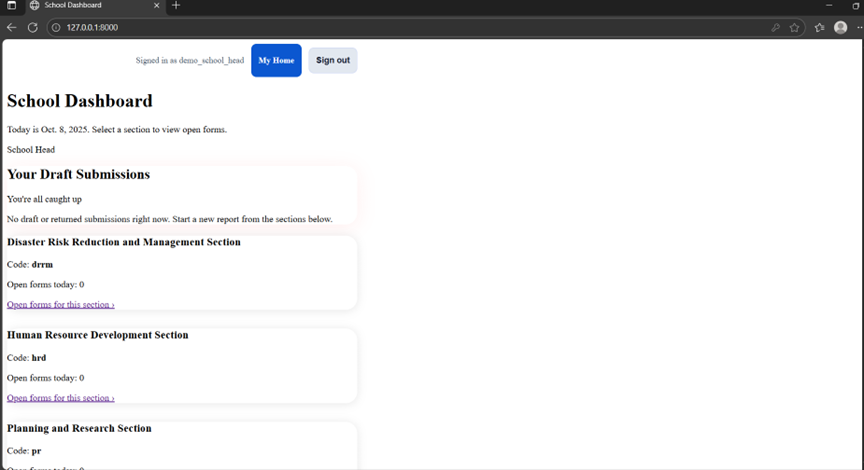
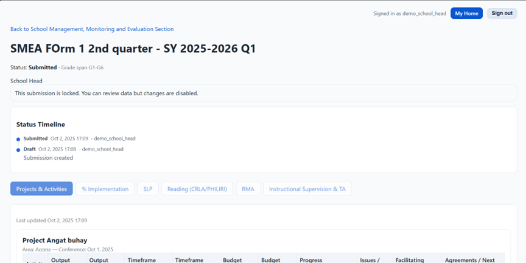

# SMME Demo Guide

## Seeded Accounts
- SGOD Admin: sgod_admin / demo12345
- Section Admin: section_admin_smme / demo12345
- PSDS: psds_flora / demo12345
- School Head: schoolhead_luna / demo12345

## Demo Flow
1. Log in as **School Head** -> show school home and draft/resubmission flow  
   
2. Switch to **Section Admin** -> review queue, recent actions, tabs view  
   
3. Log in as **SGOD** -> highlight school home alerts, division overview chips, district gaps  
     
   
4. Visit **School Profiles** console -> filters/search, edit profile form.
   
5. Open **Directory Tools** (SGOD) to create a school / reset a password.
   
   
6. Optional: open **Submission tabs** to show strand/grade-span chips in context.  
   

## Talking Points
- Profile alerts (missing contact/grade span) and chips in dashboards.
- Unified UI components (buttons, cards, tables) for clarity.
- Next steps: profile-driven forms/exports, section registry.

## Screenshot References
- Division Dashboard (filters & summary): [division-dashboard-01.png](screenshots/division-dashboard-01.png)
- Division Dashboard (district table): [division-dashboard-02.png](screenshots/division-dashboard-02.png)
- Division Overview table with profile chips: [division-overview-table.png](screenshots/division-overview-table.png)
- District gaps with warnings: [district-gaps.png](screenshots/district-gaps.png)
- School home (SGOD alerts): [school-home.png](screenshots/school-home.png)
- School profile list filters: [school-profile-list.png](screenshots/school-profile-list.png)
- Section admin queue: [smme-dashboard-01.png](screenshots/smme-dashboard-01.png)
- Submission tabs (Projects & Activities): [submission-tab-projects.png](screenshots/submission-tab-projects.png)
